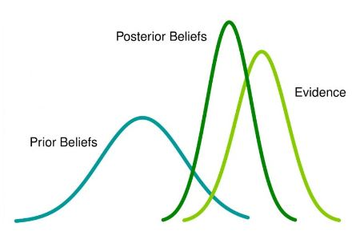
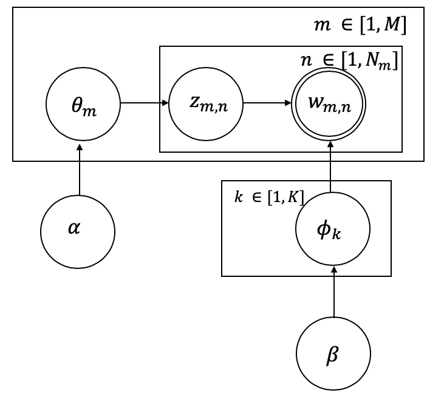

+++
title = "Building a LDA-based Book Recommender System"
date = '2018-02-08'
tags = [ "LDA", "Bayesian topic modelling", "Inference", "recommender system", "Class18/19"]
categories = ["Course projects"]
banner = "img/seminar/financial_time_series/timeseries.PNG"
author = "Andrew McAllister, Ivana Naydenova, Quang Nguyen Duc"
disqusShortname = "https-humbodt-wi-github-io-blog"
description = "A Book Recommender System"
+++

# Building a LDA-based Book Recommender System
#### Autors: Andrew McAllister, Ivana Naydenova, Quang 

 
[Source: http://people.ischool.berkeley.edu/~vivienp/presentations/is296/ass1nonfiction.html]

# Table of Contents
-------------------
1.  [The task: Building a books recommendation engine](#thetask)
2.  [Related work](#relatedwork)
3.  [What is LDA?](#whatisLDA)
4.  [Parameter estimation](#PE)
    1.  [Inference](#inference)
    2.  [Bayes Theorem](#BT)
    3.  [Model-Based Bayesian Inference](#MBBI)
5.  [Multinomial Distribution](#MD)
    1. [Dirichlet distribution — what is it, and why is it useful?](#diriclet)
6.  [LDA as a Generative process](#generative)
7.  [Posterior computation for LDA](#posterior)
    1.  [Gibbs sampling](#gibbs)
    2.  [Variational inference](#VI)
8.  [Book Similarity Computation](#similarity)
    1.  [LDA and Jaccard Similarity](#jaccard)
9.  [Implementation](#inplementation)
    1.  [Building a book recommender in Python](#inplementation)
10. [Conclusion](#conclusion)
11.  [References](#references)


## The task: Building a books recommendation engine <a class="anchor" id="thetask"></a>

Latent Dirichlet Allocation is a type of unobserved learning algorithm in which topics are inferred from a dictionary of text corpora whose structures are not known (are latent). The practical use of such an algorithm is to solve the cold-start problem, whereby analytics can be done on texts to derive similarities in the dictionary's corpses, and further be expanded to others outside the original scope - all without user input, which is often an early stumbling block for businesses that do not meet early usage quotas to derive needed analysis. 

What we will be applying this to towards the end of this article is a recommendation engine for books based on their Wikipedia articles. Our recommendation engine aims to help users find books which might be interesting for them based on their summaries. At this point the algorithm is fully content based, lacking user input for collaborative filtering completely, but serves to illustrate the potential of such algorithms in forming the basis of high-level business implementable hybrid filters.

The data for the project - all books on Wikipedia - is collected from Wikipedia Dumps from the 1st of January, 2019, in their compressed forms. Using techniques outlined by Will Koehrsen of Medium's Towards Data Science  we use a process of XML handlers to separate out individual pages, myparserfromhell's Wikipedia parser to derive the article titles, article contents, and length of each article, and further paralyze the process to assure optimal speed when going through all 15.8 GBs of compressed data ([Link to the original article]( https://towardsdatascience.com/wikipedia-data-science-working-with-the-worlds-largest-encyclopedia-c08efbac5f5c)). Our thanks to Mr. Koehrsen for his techniques on how to access and create such an interesting data set for our analysis.

What follows is an overview of the related work on this topic followed by an explanation of the theoretics behind LDA to set the groundwork of our implementation. At the end, we will work through the full codes and present specific results of the algorithm, as well as discuss some of its shortcomings.


## Related work <a class="anchor" id="relatedwork"></a>

The Latent Dirichlet Allocation (LDA) model and the Variational EM algorithm used for training the model were proposed by Blei, Ng and Jordan in 2003 (Blei et al., 2003a). Blei et al. (2003b) described LDA as a “generative probabilistic model of a corpus which idea is that the documents are represented as weighted relevancy vectors over latent topics, where a distribution over words characterizes a topic”. This topic model belongs to the family of hierarchical Bayesian models of a corpus, which has the purpose to expose the main themes of a corpus that can be used to classify, search, and investigate the documents of the corpus. 
In LDA models, a topic is a distribution over the feature space of the corpus, and several topics with different weights can represent each document. According to Blei et al. (2003a), the number of topics (clusters) and the proportion of vocabulary that create each topic (the number of words in a cluster) are considered to be tbe two hidden variables of the model. The conditional distribution of words in topics, given these variables for an observed set of documents, is regarded as the primary challenge of the model.

Griffiths and Steyvers (2004), used a derivation of the Gibbs sampling algorithm for learning LDA models to analyze abstracts from  [PNAS](https://www.pnas.org) by using Bayesian model selection to set the number of topics. They proved that the extracted topics capture essential structure in the data, and are further compatible with the class designations provided by the authors of the articles. They drew further applications of this analysis, including identifying ‘‘hot topics’’ by examining temporal dynamics and tagging abstracts to illustrate semantic content. The work of Griffiths and Steyvers (2004) proved the Gibbs sampling algorithm is more efficient than other LDA training methods (e.g., Variational EM). The efficiency of the Gibbs sampling algorithm for inference in a variety of models that extend LDA is associated with the "the conjugacy between the Dirichlet distribution and the multinomial likelihood". Thus, when one does sampling, the posterior sampling becomes easier, because the posterior distribution is the same as the prior, and it makes inference feasible. Therefore, when we are doing sampling, the posterior sampling becomes easier. (Blei et al., 2009; McCallum et al., 2005).

Mimno et al. (2012) introduced a hybrid algorithm for Bayesian topic modeling, in which the main effort is to merge the efficiency of sparse Gibbs sampling with the scalability of online stochastic inference. Their approach decreases the bias of variational inference and can be generalized by many Bayesian hidden-variable models.

LDA is being applied in various Natural Language Processing tasks such as for opinion analysis (Zhao et al., 2010), for native language identification (Jojo et al., 2011) and for learning word classes (Chrupala, 2011).

In this blog post, we focus on the task of automatic text classification into a set of  topics using LDA, in order to help users find books which might be interesting for them based on their summaries.  

##  What is LDA? <a class="anchor" id="whatisLDA"></a>

Latent Dirichlet Allocation is a type of unobserved learning algorithm in which topics are inferred from a dictionary of text corpora whose structures are not known (are latent). The practical use of such an algorithm is to solve the cold-start problem, whereby analytics can be done on texts to derive similarities in the dictionary's corpses, and further be expanded to others outside the original scope - all without user input, which is often an early stumbling block for businesses that do not meet early usage quotas to derive needed analysis. 

What we will be applying this to towards the end of this article is a recommendation engine for books based on their Wikipedia articles. Our recommendation engine aims to help users find books which might be interesting for them based on their summaries. At this point the algorithm is fully content based, lacking user input for collaborative filtering completely, but serves to illustrate the potential of such algorithms in forming the basis of high-level business implementable hybrid filters.

The data for the project - all books on Wikipedia - is collected from Wikipedia Dumps from the 1st of January, 2019, in their compressed forms. Using techniques outlined by Will Koehrsen of Medium's Towards Data Science  we use a process of XML handlers to separate out individual pages, myparserfromhell's Wikipedia parser to derive the article titles, article contents, and length of each article, and further paralyze the process to assure optimal speed when going through all 15.8 GBs of compressed data ([Link to the original article]( https://towardsdatascience.com/wikipedia-data-science-working-with-the-worlds-largest-encyclopedia-c08efbac5f5c)). Our thanks to Mr. Koehrsen for his techniques on how to access and create such an interesting data set for our analysis.

What follows is an overview of the related work on this topic followed by an explanation of the theoretics behind LDA to set the groundwork of our implementation. At the end, we will work through the full codes and present specific results of the algorithm, as well as discuss some of its shortcomings.


In order to understand the kind of books that a certain user likes to read, we used a natural language processing technique called Latent Dirichlet Allocation (LDA )used for identifying hidden topics of documents based on the co-occurrence of words collected from those documents.

The general idea of LDA is that 
>each document is generated from a mixture of topics and each of those topics is a mixture of words.

Having this in mind, one could create a mechanism for generating new documents, i.e. we know the topics a priori, or for inferring topics present in a set of documents which is already known for us. This bayesian topic modelling technique can be used to find out how high the share of a certain document devoted to a particular topic is, which allows the recommendation system to categorize a book topic, for instance, as 30% thriller and 20% politics. These topics will not and do not have to be explicitly defined. Managers looking to apply LDA will often expect that outputs of specific topic classes will be provided by the analysis, but this is often extraneous - or potentially harmful to the robust potential of the analysis when a topic set is chosen such that they can be easily defined by human intuition. In our analysis, we will directly name any of our found topics, but will draw the reader's attention to when the words do seem to fit in a potential topic.

Concerning the model name, one can think of it as follows (Blei et al., 2003a):

`Latent`: Topic structures in a document are latent meaning they are hidden structures in the text.

`Dirichlet`: The Dirichlet distribution determines the mixture proportions of the topics in the documents and the words in each topic.

`Allocation`: Allocation of words to a given topic.

##   Parameter estimation <a class="anchor" id="PE"></a>

LDA is a generative probabilistic model, so to understand exactly how it works one needs first to understand the underlying probability distributions.
The idea behind probabilistic modeling is (Blei et al., 2003a):
- to treat data as observations that arise from some kind of generative probabilistic process (the hidden variables reflect the thematic structure of the documents (books) collection),
- to infer the hidden structure using posterior inference (What are the topics that describe this collection?) and
- to situate new data into the estimated model (How does a new document fit into the estimated topic structure?)

In the next sectios we will focus on the multinomial and Dirichlet distributions utilized by LDA.

### Inference <a class="anchor" id="inference"></a>

Having specified the statistical model structure, the crucial part now is to find a method for estimating the relevant parameters. As shown in the previous section, our model is based on the joint probability distribution over both observable data and hidden model parameters. Such models are considered as probabilistic *generative models*. In comparison, *discriminative* models like e.g. logistic regression or SVMs, directly model the conditional probability $P(Y|X=x)$ of some target variable $Y$ with given observations $x$.

Parameter estimation, or more precisely statistical inference, on generative models are generally approached by Bayesien inference. In essence, bayesian inference applies the Bayes theorem on statistical models to draw conclusions from the data about the parameter distribution of interest.


#### Bayes Theorem <a class="anchor" id="BT"></a>
Before introducing the concept of Baysian inference, it is necessary to provide the Bayes' theorem. An advantage of this theorem is the ability to include prior knowledge or belief to calculate the probability of related events.

Mathematically, the Bayes' theorem can be stated as follows:
$$P(A|B)=\frac{P(B|A)P(A)}{P(B)}$$
where
* $A$ and $B$ are events with $P(B)\neq0$

#### Model-Based Bayesian Inference <a class="anchor" id="MBBI"></a>
The introductory definition of Bayes' rule will now be adopted to the model form in order to represent the data and parameters.
In the section above we have only used single numbers for the terms in the Bayes' theorem equation. However, when applying Bayes' rule to more complex machine learning models, this is not sufficient. As prior beliefs often contain uncertainty, probability distributions over a range of values are more appropriate. The same logic applies to the other terms of the equation. Therefore, probabilities $P(.)$ are replaced by densities $p(.)$.

Furthermore, the events $A$ and $B$ are replaced by the model parameters and the observed data. The observed data is represented by $y=\{y_1,y_2,...,y_N\}$ and the set of parameters (which we are typically interested in) is denoted as $\Theta$
Taking everything into account and using the Bayes' rule, the Baysian inference model is formalized as

$$p(\Theta|y)= \frac{p(y|\Theta)p(\Theta)}{p(y)}$$

with the following components:
* $p(\Theta)$ is the **prior distribution** (or simply: prior) of the parameter set $\Theta$ and is used as a means of expressing uncertainty about $\theta$ before observing the data. As a probability distribution, it contains its own set of parameters which are called hyperparameters, to differentiate them from the model parameters $\Theta$.
* $p(y|\Theta)$ is the **sampling distribution**, which models the probability of observable data $y$ given latent model parameters $\Theta$. It is also often called the **likelihood** (function) when it is viewed as a function of $\Theta$.
* $p(y)$ defines the **marginal likelihood** of $y$ and is also called the **evidence**.
* $p(\Theta|y)$ is the **posterior distribution** giving the updated probability of the parameters $\Theta$ after taken both the prior and the data into account

 

##  Multinomial Distribution <a class="anchor" id="MD"></a>

Instead of maximum-likelihood, Bayesian inference encourages the use of predictive densities and evidence scores. This is illustrated in the context of the multinomial distribution, where predictive estimates are often used but rarely described as Bayesian (Minka, 2003).

Now we will describe the multinomial distribution which is used to model the probability of words in a document. For this reason, we will also discuss the conjugate prior for the multinomial distribution, the `Dirichlet distribution`.

Given a set of documents, one can choose values for the parameters of a probabilistic model that make the training documents have high probability ([Elkan, 2014](http://cseweb.ucsd.edu/~elkan/250B/topicmodels.pdf)).  Considering a test document, one can evaluate its probability according to the model: The higher the probability is, the more similar the test document is to the initial set of documents. For this purpose, the multinomial distribution could be applied with the following probability distribution function:

$$
p(x; \theta)=\bigg(\frac{n!}{\prod^{m}_{j=1}}\bigg)\bigg(\prod^{m}_{j=1}\theta_{j}^{x_{j}}\bigg),
$$
where $\theta_{j}$ is the probability of word *j* while $x_{j}$ is the count of a word *j*.

So every time, a certain word *j* appears in the document it contributes an amount  $\theta_{j}$ to the total
probability ( $\theta_{j}^{x_{j}}$).  
In this equation,  the first factor in parentheses is called a multinomial coefficient, which represents the size of the equivalence class of *x*, while the second factor in parentheses is the probability of any individual member of the equivalence class of *x*.


### Dirichlet distribution — what is it, and why is it useful? <a class="anchor" id="dirichlet"></a>

The Dirichlet distribution is used for representation of the distributions over the simplex (the set of N-vectors whose components sum to 1) and  is a useful prior distribution on discrete probability distributions over categorical variables.

It is a conjugate prior to the categorical and multinomial distributions (meaning that multiplying a Dirichlet prior by a multinomial or categorical likelihood will yield another Dirichlet distribution of a certain form). However, the primary difference between Dirichlet and multinomial distributions is that Dirichlet random variables are real-valued, where each element of the vector is in the interval $[0, 1]$, and multinomial random variables are integer-valued.


The Dirichlet distribution defines a probability density for a vector valued input having the same characteristics as our multinomial parameter $\theta$.


\begin{equation}
Dir (\vec\theta\mid \vec\alpha)={\frac {\Gamma (\Sigma_{i=1}^{K}\alpha_{i})}{\prod _{i=1}^{K}\Gamma (\alpha_{i})}}\prod _{i=1}^{K}\theta_{i}^{\alpha_{i}-1}
\end{equation}


This equation  is often represented using the Beta function in place of the first term as seen below:


\begin{equation}
Dir (\vec\theta\mid \vec\alpha)={\frac {1}{B(\alpha)}}\prod _{i=1}^{K}\theta_{i}^{\alpha_{i}-1}
\end{equation}

Where:

\begin{equation}
\frac {1}{B(\alpha)} = {\frac {\Gamma (\Sigma_{i=1}^{K}\alpha_{i})}{\prod _{i=1}^{K}\Gamma (\alpha_{i})}}
\end{equation}


The Dirichlet distribution is parameterized by the vector $\alpha$, which has the same number of elements *K* as our multinomial parameter $\theta$ (Thomas Boggs, 2014). Thus, one could interpret $p(\theta \mid\alpha)$ as responding to the question “what is the probability density associated with multinomial distribution $\theta$, given that our Dirichlet distribution has parameter $\alpha$.

To get a better sense of what the distributions look like, let us visualize a few examples in the context of topic modeling. 

The Dirichlet distribution takes a number ($\alpha$) for each topic. The GIF below shows the iterations of taking 1000 samples from a Dirichlet distribution using an increasing alpha value. Every topic gets the same alpha value one could see displayed, and the dots represent  a  distribution or mixture of the three topics having certain coordinates such as (0.6, 0.0, 0.4) or (0.4, 0.3, 0.3). Low $\alpha$-values account for the case where most of the topic distribution samples are in the corners (near the topics). Having values (1.0, 0.0, 0.0), (0.0, 1.0, 0.0), or (0.0, 0.0, 1.0) would mean that the observed document would only ever have one topic in case  a three topic probabilistic topic model is build.

Usually, one aims to end up with a sample favoring only one topic or a sample that gives a mixture of all topics, or something in between. In case the $\alpha$-values>1, the samples start to congregate to the center. With greater $\alpha$ the samples will more likely be uniform or a homogeneous mixture of all the topics.

Typically one aims to find more than three topics depending on the number of observed documents. In the ideal case,  the composites to be made up of only a few topics and our parts to belong to only some of the topics.


```python
from IPython.display import Image
from IPython.core.display import HTML 
Image(url= "https://cdn-images-1.medium.com/max/800/1*_NdnljMqi8L2_lAYwH3JDQ.gif", width=700)


```


  


## LDA as a  Generative process <a class="anchor" id="generative"></a>


LDA is being often described as the simplest topic model (Blei and Lafferty, 2009): The intuition behind this model is that documents exhibit multiple topics. Furthermore, one could most easily describe the model by its generative process by which the model assumes the documents in the collection arose (Blei, 2012).


LDA can be described more formally with the following notation:

 
[Source: Blei, 2012.]


- A document-to-topic model parameter $\theta_{m}$ is used to generate the topic for the $n^{th}$ word in the doument *d*  denoted by $z_{m,n}$, for all n of [1; N]. 
- A topic-to-word model $\phi_{k}$ is used to generate the word $w_{m,n}$ for each topic $k=z_{m,n}$

Those two steps can be seen on the graphical model above, where  the document-to-topic model and the topic-to-word model essentially follow multinomial distributions (counts of each topic in a document or each word in a topic), a good prior for their parameters, would be Dirichlet distribution, explained [here](#diriclet).


Assuming that the word distributions for each topic vary based on a Dirichlet distribution, as do the topic distribution for each document, and the document length is drawn from a Poisson distribution, one can generate the words in a two-stage process for each document in the whole data collection:

1. Randomly choose a distribution over topics.
2. For each word in the document:
   -  A topic is being randomly chosen from the distribution over topics in the first step.
      -  Sample parameters for document topic distribution
      - $\theta_{m}$ follows the $Dir(\alpha_{m}\mid \alpha)$ distribution, after  observing topics in the document and obtaining the counting result $n_{m}$, one could calculate  the posterior for $\theta_{m}$ as $Dir(\alpha_{m}\mid n_{m}+\alpha)$. Thus, the topic distribution for the *m*th document is
      $$
      p(z_{m}\mid \alpha)=\frac{\Delta(n_{m}+\alpha)}{\Delta(\alpha)}
      $$
and the topic distribution for the all document is 

 $$
 p(z\mid\alpha)= p(w,z\mid\alpha,\beta)= \displaystyle\prod_{m=1}^{M}\frac{\Delta(n_{m}+\alpha)}{\Delta{\alpha}}
 $$
      
    - we assume, similarly, for the *k*th topic, that the prior for the topic-to-word model's parameter $\phi_k$ follows the $Dir(\phi_k\mid \beta)$ distribution, after  observing words in the topic and obtaining the counting result $n_{k}$, one could calculate  the posterior for $\phi_{k}$ as $Dir(\phi_k\mid n_{k}+\beta)$. Thus, the word distribution for the *k*th topic is
    
        $$
      p(w_{k}\mid z_{k}, \beta)=\frac{\Delta(n_{k}+\beta)}{\Delta(\beta)}
      $$
and the word distribution for the all topics is 

 $$
 p(w_{k}\mid z, \beta)=\displaystyle\prod_{m=1}^{M}\frac{\Delta(n_{k}+\beta)}{\Delta(\beta)}
 $$
    
    
The distinctive characteristic of LDA is that all the documents in the collection share the same set of topics and each document exhibits those topics in different proportion.

Using this notation, the generative process for LDA  is equivalent  to the following joint distribution of the hidden and observed variables (Blei, 2012):


\begin{equation*}
p(w,z\mid\alpha,\beta)=p(w\mid z,\beta)p(z\mid \alpha)=\displaystyle\prod_{k=1}^{K}\frac{\Delta(n_{k}+\beta)}{\Delta{\beta}}\displaystyle\prod_{m=1}^{M}\frac{\Delta(n_{m}+\alpha)}{\Delta{\alpha}}
\end{equation*}


##  Posterior computation for LDA <a class="anchor" id="posterior"></a>

As already mentioned,  
> the aim of topic modelling is to automatically discover the topics from a collection of documents, which are observed, while the topic structure is hidden.  

This can be thought of as “reversing” the generative process by asking *what is the hidden structure that likely generated the observed collection?* 

We now turn to the computational problem, computing the conditional distribution of the topic structure given the observed documents (called the *posterior*.) Using our notation, the posterior is 

$$p(\theta,\phi, z \mid w, \alpha, \beta) = \frac{p(\theta,\phi, z, w, \mid \alpha, \beta)}{p(w, \mid \alpha, \beta)}$$

The left side of the equation gives us the probability of the document topic distribution, the word distribution of each topic, and the topic labels given all words (in all documents) and the hyperparameters  $\alpha$ and $\beta$. In particular, we are interested in estimating the probability of topic (z) for a given word (w) (and our prior assumptions, i.e. hyperparameters) for all words and topics.

> ###  A central research goal of modern probabilistic modelling is to develop efficient methods for approximating the posterior inference (Blei, 2012). 

### Gibbs sampling <a class="anchor" id="gibbs"></a>

The general Idea of the Inference process is the following ([Tufts, 2019](https://ldabook.com/index.html)): 

1. Initialization: Randomly select a topic for each word in each document from a multinomial distribution.
2. Gibbs Sampling:
   - For *i* iterations
   - For document *d* in documents:
      - For each word in document *d*:
         - assign a topic to the current word based on probability of the topic given the topic of all other words (except the current word).

This procedure is repeated until the samples begin to converge to what would be sampled from the actual distribution. While convergence is theoretically guaranteed with Gibbs Sampling, there is no way of knowing how many iterations are required to reach the stationary distribution ([Darling, 2011](http://u.cs.biu.ac.il/~89-680/darling-lda.pdf)). Usually, an acceptable estimation of convergence can be obtained by calculating the log-likelihood or even, in some situations, by inspection of the posteriors.

When applying LDA, one is interested in the latent document-topic portions $\theta_{d}$, the topic-word distributions $\phi(z)$, and the topic index assignments for each word $z_{i}$. While conditional distributions – and therefore an LDA Gibbs Sampling algorithm – can be derived for each of these latent variables, we note that both $\theta_{d}$ and $\phi(z)$ can be calculated using just the topic index assignments $z_{i}$ ([Darling, 2011](http://u.cs.biu.ac.il/~89-680/darling-lda.pdf)). To this reason,  [Griffiths and Steyvers (2004)](http://psiexp.ss.uci.edu/research/papers/sciencetopics.pdf) applied a simpler algorithm, called *collapsed Gibbs sampler*, which integrates out the multinomial parameters and sample $z_{i}$. 

To compute the  *collapsed Gibbs sampler* updates efficiently, the algorithm maintains and makes use of several count matrices during sampling ([Papanikolaou et al., 2017](http://www.jmlr.org/papers/volume18/16-526/16-526.pdf)):
- $n_{kv}$ represents the number of times that word type v is assigned to topic k across the corpus, 
- $n_{dk}$ represents the number of word tokens in document d that have been assigned to topic k. 

The equation giving the probability of setting $z_{i}$ to topic k, conditional on $w_{i},d$, the hyperparameters $\alpha$ and $\beta$, and the current topic assignments of all other word tokens (represented by ·) is:

$$p(z_{i}=k\mid w_{i}=v, d, \alpha, \beta, ·)\propto \frac{n_{kv\neg i}+\beta_{v}}{\Sigma_{v'=1}^{V}(n_{kv\neg i}+\beta_{v})} . \frac{n_{dk\neg i}+\alpha_{k}}{N_{d}+\Sigma_{k'=1}^{K}\alpha_{k'}}$$

The exclusion of the current topic assignment of $w_{i}$ of from all count matrices is annotated by $\neg i $. A common practice is to run the Gibbs sampler for many iterations before retrieving estimates for the parameters, and the one can retrieve estimates for the variables of interest.

By using Rao-Blackwell estimators Griffiths and Steyvers, (2004) computed a point estimate of the probability of word type *v* given topic *k* ($\hat{\phi_{kv}}$) and  a point estimate for the probability of the topic *k* given document *d* ($\hat{\theta_{dk}}$):

$$
\hat{\phi_{kv}}=\frac{n_{kv}+\beta_{v}}{\Sigma_{v'=1}^{V}(n_{kv}+\beta_{v})}
$$

$$
\hat{\theta_{dk}}=\frac{n_{dk}+\alpha_{k}}{N_{d}+\Sigma_{k'=1}^{K}\alpha_{k'}}
$$

When applying the *collapsed Gibbs sampler* on new documents during the prediction stage, a common practice is to fix the $\phi$ distributions and set them to the ones learned during estimation:

$$p(z_{i}=k\mid w_{i}=v, d, \alpha,\hat{\phi_{kv}} , ·)\propto \hat{\phi_{kv}} . \frac{n_{dk\neg i}+\alpha_{k}}{N_{d}+\Sigma_{k'=1}^{K}\alpha_{k'}}$$


### Variational Inference <a class="anchor" id="VI"></a>
Blei et al. (2003) first introduced LDA using an inference method based on variational inference. As the derivation and its mathematical details are out of scope for this introduction to the LDA, we provide an intuition for the steps involved.
The general idea of this method is to approximate the intractable posterior distribution $P$ by a tractable distribution $Q_V$ with a set of free variational parameters $V$. The goal then is to eventually find parameters $V$ which minimizes the *Kullback-Leibler (KL) divergence* $KL(Q_V||P)=\sum Q_V \log{\frac{Q_V}{P}}$. The key advantage is that this process can be done without computing the actual posterior distribution and still approach the posterior up to an constant, which is independent of the variational parameters. Moreover, these parameters $V$ are only dependend on the obervable data $w$.

##### Model
The specific approach taken here is referred as a *mean field approximation*, where we assume the following:
* All target variables are independent of each other
* Each variable has its own variational parameter

With these assumptions, we can set up the model:
* **Probability of topic $z$ given document $d$**: $q(\theta_d|\gamma_d)$  
Each document has its own Dirichlet prior $\gamma_d$
* **Probability of topic assignment to word $w_{d,n}$**: $q(z_{d,n}|\phi_{d,n})$  
Each $n^{th}$-word in document $d$ has its own multinomial over topics $\phi_{d,n}$  

#### Inference
The inferential step estimates the parameters of $q(\theta,z|\gamma,\phi)$ by minimizing the KL divergence  

$$KL[q(\theta,z|\gamma,\phi) \ || \ p(\theta,z|w,\alpha,\beta)]$$  

The KL divergence, also known as relative entropy, is a function which quantitatively measures the "difference" between two probability distributions. Thus, the lower the value of KL, the more similar are both distributions $q(\theta,z|\gamma,\phi)$ and $p(\theta,z|w,\alpha,\beta)$. The optimization problem is therefore given by 

$$\gamma^*,\phi^* = argmin_{(\gamma,\phi)} KL[q(\theta,z|\gamma,\phi) \ || \ p(\theta,z|w,\alpha,\beta)]$$

Using the definition of the KL divergence function, Blei et. al (2003) derive the equation

$$KL[q(\theta,z|\gamma,\phi) \ || \ p(\theta,z|w,\alpha,\beta)] = - L(\gamma, \phi|\alpha,\beta) + \log p(w, \alpha,\beta)$$  
with $L(\gamma, \phi|\alpha,\beta) = E_q[\log p(\theta, z, w|\alpha,\beta)]-E_q[\log q(\theta,z|\gamma, \phi)]$

and additionally applying Jensen's inequality, it follows the inequality

$$\log p(w|\alpha, \beta) \geq L(\gamma, \phi|\alpha,\beta)$$

In the first equation we can see that the minimization problem turns into a maximization problem of some likelihood function $L(\gamma, \phi|\alpha,\beta)$, as the second term is constant and can be ignored. The left hand side of the second equation shows the log-likelihood of the evidence of our posterior distribution. This inequality is commonly knows as the *evidence lower bound*, abbreviated as ELBO. The interpretation of this ELBO has some positive insights: As we aim to maximize $L(\gamma, \phi|\alpha,\beta)$ (which is equivalent to minimize the KL divergence), we simultaneously maximize the lower bound of our evidence. Remember that the evidence gives the probability of our observed data, given our model parameters. Hence, by optimizing the parameters, we increase our confidence of the observed data. In fact, this is similar to the intuition of the maximum likelihood estimation, where we estimate parameters such that the probability of our observed data is maximum.
What we can see on the left hand side is the log-likelihood of the evidence of our posterior probability, whereas $L(\gamma, \phi|\alpha,\beta)$ represents the equivalent optimzation

#### Variational EM-algorithm
However, a closed-form solution can not be derived for maximizing the objective function $L(\gamma, \phi|\alpha,\beta)$. Hence, Blei et. al have proposed a variational expectation maximization (variational EM) algorithm to iteratively solve this optimization problem. 

The derivation of the parameter estimatiosn by using the variational EM algorithm is quite lengthy but the intuition can be summarized as follows:

**Goal**: Find $\alpha, \beta$ which maximize the marginal log-likelihood $l(\alpha,\beta|w)=\sum_d \log p(w_d|\alpha,\beta)

1. Define and initialize a tractable distribution $q(\theta,z|\gamma,\phi)$ that defines a lower bound of the log-likelihood of the actual data.
2. Iterate the two following steps until $l(\alpha,\beta|w)$ converges: 
    * **E-step**: Update $\gamma^*, \phi^*$ to get new approximated posteriors $q(\theta,z|\gamma,\phi)$. For each document, find optimal values of its variational parameters. This is basically the  optimization equation above.
    * **M-step**: Update $\alpha, \beta$ to get new evidence $p(\theta, z, w|\alpha,\beta)$. The parameters $\alpha, \beta$ are chosen such that the resulting lower bound of the log likelihood are maximum. Usually this corresponds to finding maximum likelihood estimates of  $\alpha, \beta$ for each document under the new approximate posterior $q(\theta,z|\gamma^*,\phi^*)$

## Book Similarity Computation <a class="anchor" id="similarity"></a>
### LDA and Jaccard Similarity <a class="anchor" id="jaccard"></a>

As already mentioned, we will apply the LDA algorithm to extract the latent topics within
Wikipedia's book summaries. This is followed by aggregation of most frequently occurring topics and their utilization in order to calculate the *Jaccard Similarity* between the topics of other book summaries. The combination of latent topics and similarity measurement allows one to uncover both topics and apparent relationships between the summaries of two establishments ([Yang and Provinciali, 2015](https://pdfs.semanticscholar.org/1af2/cbbc99a9f4eb0fe69ff3483fb28b6066b82b.pdf)).

The *Jaccard similarity* coefficient measures similarity between two finite sample sets *A* and *B* by counting the number of items they have in common and dividing by the total number of unique items between them:

\begin{equation*}
J(A,B)= \frac{\mid A \cap B \mid}{\mid A \cup B\mid }
\end{equation*}

When the *Jaccard similarity* coefficient is above a certain threshold, a high correlation between the latent characteristics of two books is implied.

>  However, a content-based recommendation system will not perform on the highest level, if there is no data on user’s preferences, regardless of how detailed our metadata is.


# Implementation <a class="anchor" id="implementation"></a>
### Building a book recommender in Python


```python

```

## References 


Blei, D.M., Lafferty, J.D.: Topic models. Text mining: Classification, clustering, and applications 10 (2009) 71

Blei, D.M., Ng, A.Y., Jordan, M.I. Latent Dirichlet allocation. *Journal of Machine Learning Research* 3 (2003a) 993–1022.

Blei, D.M.: Probabilistic topic models. Commun. *ACM* 55, 4 (April 2012), 77-84

Blei,D.M.,Griffiths,T.L.,Jordan,M.I.,Tenenbaum,J.B.: Hierarchicaltopic models and the nested Chinese restaurant process. In: Advances in Neural
Information Processing Systems, MIT Press (2004) 2003b

Chrupala,G.: Efficient induction of probabilistic word classes with LDA. In: *Proceedings of the Fifth International Joint Conference on Natural Language Processing (IJCNLP 2011)*. (2011) 363–372


Chase, G.: Inference Methods for Latent Dirichlet Allocation (2017)


Darling, William M. 2011. “A Theoretical and Practical Implementation Tutorial on Topic Modeling and Gibbs Sampling.” In *Proceedings of the 49th Annual Meeting of the Association for Computational Linguistics: Human Language Technologies*, 642–47.

Elkan, C.: [Text mining and topic models](http://cseweb.ucsd.edu/~elkan/250B/topicmodels.pdf). (2014) 

Griffiths, T.L., Steyvers, M.: Finding scientific topics. Volume 101, Suppl. 1 of *Proceedings of the National Academy of Sciences of the United States of America*. National Academy of Sciences (2004)
Information Processing Systems, MIT Press (2004) 2003.

Jojo, S.m., Wong, M., Dras, M.J.: Topic modeling for native language iden- tification. In: *Proceedings of the Australasian Language Technology Association Workshop*, Canberra, Australia (2011) 115–124

McCallum, A., Corrada-Emmanuel, A., Wang, X.: Topic and role discovery in social networks. In: *Proceedings of the 19th International Joint Confer- ence on Artificial Intelligence. IJCAI’05*, San Francisco, CA, USA, Morgan Kaufmann Publishers Inc. (2005) 786–791

Mimno, D.M., Hoffman, M.D., Blei, D.M.: Sparse stochastic inference for Latent Dirichlet Allocation. In: *Proceedings of the 29th International Con- ference on Machine Learning (ICML 2012)*. (2012)

Papanikolaou, Y.,  Foulds,J.R.,   Rubin, T. N.,   Tsoumakas, G.:Dense Distributions from Sparse Samples: Improved Gibbs Sampling Parameter Estimators for LDA. *Journal of Machine Learning Research* 18 (2017) 1-58.

Statisticat, LLC: Bayesian Inference

Tufts, C.: [The Little Book of LDA (2019)](https://ldabook.com/index.html)

Yang, A: Inferring Business Similarity from Topic Modeling [Latent Dirichlet Allocation and Jaccard Similarity applied to Yelp reviews]. (2015).


```python

```


```python

```
